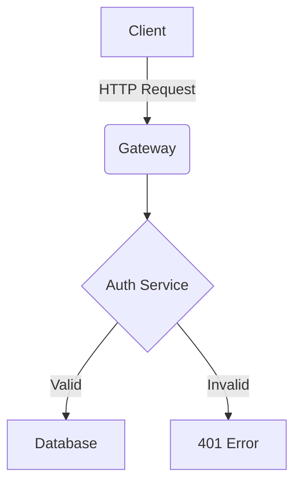

C:\Users\chris\.tizen-extension-platform\server\sdktools\data\tools\tizen-core\tz.exe

pwd för author cert är sign + övre serien

# Libraries

https://github.com/luke-chang/js-spatial-navigation/

## Tested, not useful

https://github.com/WICG/spatial-navigation

# Architecture Diagram

Here is the system layout:

